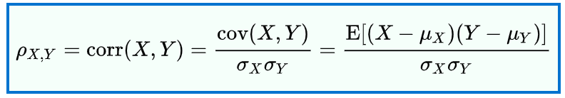
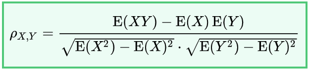
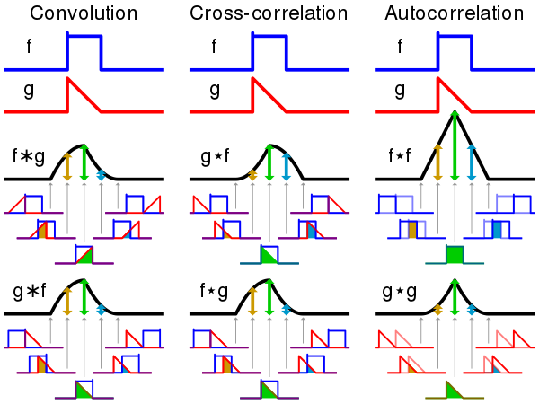
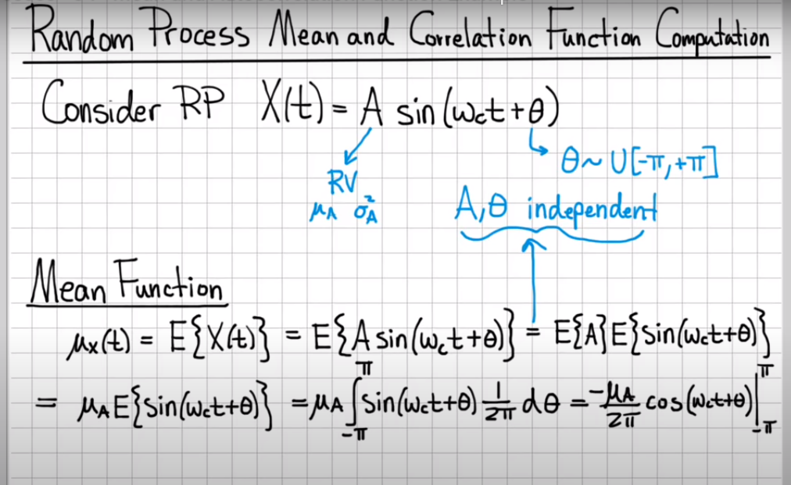
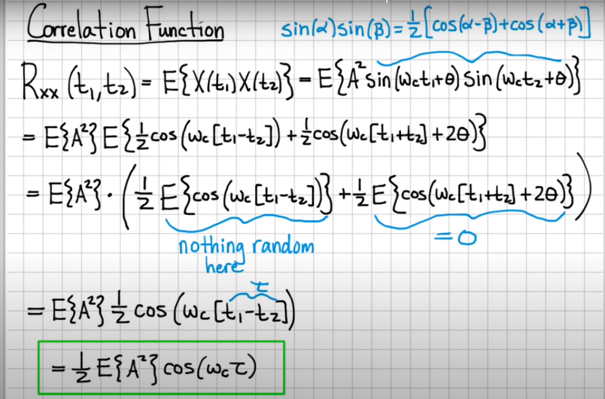
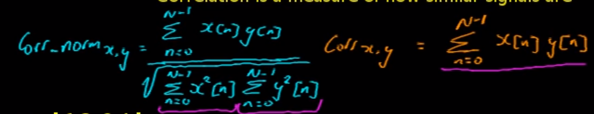
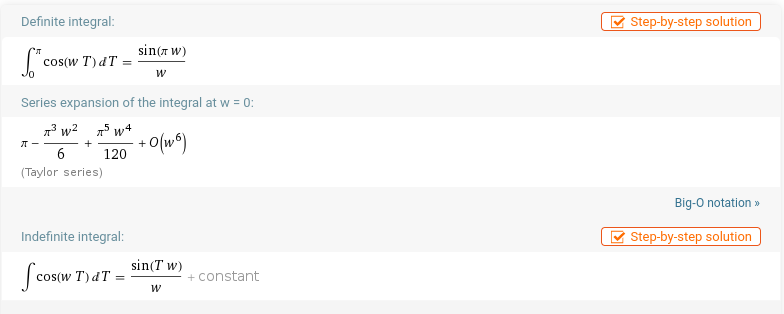
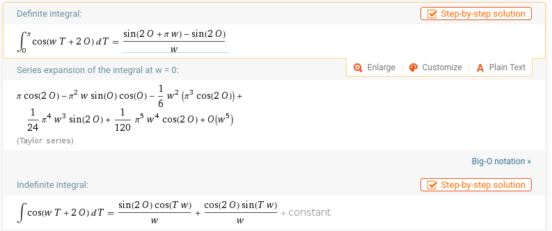

---
jupyter:
  jupytext:
    formats: ipynb,Rmd
    text_representation:
      extension: .Rmd
      format_name: rmarkdown
      format_version: '1.2'
      jupytext_version: 1.4.2
  kernelspec:
    display_name: Python 3
    language: python
    name: python3
---

```{python}
import numpy as np
import matplotlib.pyplot as plt
```

```{python}

```

# Correlation


## Pearson's product-moment coefficient

https://en.wikipedia.org/wiki/Correlation_and_dependence#Pearson's_product-moment_coefficient

Inicialmente me confundí y pense que la sintaxis XY se referia a distribuciones de probabilidad conjuntas pero son temas diferentes.


### Formula 1




### Formula 2




### Ejemplo con 2 variables discretas


```{python}
E = np.mean
S = np.std

X = np.array([1, 1, 0])
Y = np.array([-1, 0, 1])
```

```{python}
## Formula 1

XY = []
for i in X - E(X):
    for j in Y - E(Y):
        XY.append(i*j)

numerator = E(XY)
denominator = S(X)*S(Y)

MSG = """
No hay ninguna relación entre las 2 variables: {}
"""

print(MSG.format(numerator/denominator))
```

```{python}
## Formula 2

XY = []
for i in X:
    for j in Y:
        XY.append(i*j)

numerator = E(XY) - E(X)*E(Y)
denominator = (E(X**2) - E(X)**2)**0.5 * (E(Y**2) - E(Y)**2)**0.5

MSG = """
No hay ninguna relación entre las 2 variables: {}
"""

print(MSG.format(numerator/denominator))
```

```{python}

```

# Correlation function

https://en.wikipedia.org/wiki/Correlation_function



La función de correlación compara 2 series operando sobre la serie, esto genera una función. La cross-correlation es cuando comparas 2 señalas diferentes y la autocorrelación es cuando comparas una serie consigo misma pero desplazada.


## Indicador de correlación

- En el caso contino calculan el valor esperado.
- En el caso discreto usan la suma.


### Ejemplo continuo
    
- https://www.youtube.com/watch?v=DblXnXxUQc0
    
El usa como ejemplo una función continua, escoge una función sinudal que depende de dos variables aleatorias:
- La frecuencia y la amplitud, esto genera una función sinuidal con ruido.

El desarrollo analitico requiere que las variables sean independientes

#### Calculo de la media



#### Calculo de la media




### Ejemplo discreto

- https://www.youtube.com/watch?v=_r_fDlM0Dx0
  - Se puede calcular el valor esperado de la funci
    
- https://www.youtube.com/watch?v=ngEC3sXeUb4
  - Muestra la formula de la correlación normalizada
  

  
Las series que usa el man del video estan muy simples, la idea es usar una representación discreta de la sinuidal del ejemple continuo.

```{python}
N = 1000

A = np.random.normal(0, 1, N)
Th = np.random.uniform(-np.pi, np.pi, N)
wc = 1
X = lambda t: A*np.sin(wc*t + Th) 
```

```{python}
t = np.arange(0, 6*np.pi, 6*np.pi/N)
t_ticks = np.arange(0, 6*np.pi, 6*np.pi/10)
```

```{python}
fig = plt.figure(figsize=(15,8))
ax = fig.add_subplot(1, 1, 1)
ax.plot(t, X(t))
ax.set_xticks(t_ticks)
plt.show()
```

```{python}
#### Autocorrelación en el momento 0 debería de ser 1

T = 0

MSG = """
Este es el calculo usando la solución analitica: {}
"""
corr = 0.5*np.mean(A**2)*np.cos(wc*T)

print(MSG.format(corr))


MSG = """
Este es el calculo usando la solución númerica: {}
"""

nominator = np.sum( X(t)*X(t+T) )
denominator = ( np.sum(X(t)**2) * np.sum(X(t + T)**2) )**0.5

print(MSG.format(nominator/denominator))
```

### Usar el valor esperado no funciona






#### La función analitica queda así

$\sum_{n=0}^{N-1}A^2$ · $\dfrac{sin(wcT)}{2wc}$ · ($\dfrac{sin(2\theta)cos(wcT)}{wc} + \dfrac{cos(2\theta)sin(wcT)}{wc}$)

```{python}
MSG = """
Este es el calculo usando la solución analitica: {}
"""

exp_1 = np.sum(A**2)
exp_2 = np.sum(np.sin(wc*T)/2*wc)
exp_3 = np.sum((np.sin(2*Th)*np.cos(wc*T)/wc) + (np.cos(2*Th)*np.sin(wc*T)/wc))

print(MSG.format(exp_1*exp_2*exp_3))
```

```{python}
np.sin(wc*T)/2*wc
```

```{python}
np.sum(A**2)
```

```{python}

```
